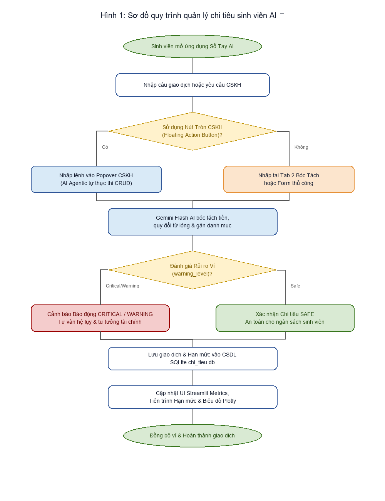

# 06 - THIẾT KẾ CƠ SỞ DỮ LIỆU VÀ GIAO DIỆN (DATABASE DESIGN & SCREENFLOW)

## 1. Thiết kế Cơ sở Dữ liệu SQLite (chi_tieu.db)

### Bảng giao_dich
| Tên cột | Kiểu dữ liệu | Ràng buộc | Mô tả |
| :--- | :--- | :--- | :--- |
| id | INTEGER | PRIMARY KEY AUTOINCREMENT | Mã định danh giao dịch |
| loai | TEXT | NOT NULL | Loại giao dịch ('Thu' hoặc 'Chi') |
| so_tien | REAL | NOT NULL | Số tiền (VNĐ) |
| danh_muc | TEXT | NOT NULL | Danh mục chi tiêu |
| ngay | TEXT | NOT NULL | Ngày giao dịch (YYYY-MM-DD) |
| ghi_chu | TEXT | NULL | Ghi chú mô tả |
| created_at | TIMESTAMP | DEFAULT CURRENT_TIMESTAMP | Thời điểm tạo |

### Bảng han_muc
| Tên cột | Kiểu dữ liệu | Ràng buộc | Mô tả |
| :--- | :--- | :--- | :--- |
| danh_muc | TEXT | PRIMARY KEY | Tên danh mục |
| so_tien_limit | REAL | NOT NULL | Hạn mức ngân sách tối đa (VNĐ) |

## 2. Sơ đồ Luồng Quy Trình Nghiệp Vụ BPMN (Process Flow Diagram)
Dưới đây là sơ đồ quy trình xử lý giao dịch và tương tác với Trợ lý AI Gemini:

*Hình 1: Sơ đồ luồng quy trình hệ thống Quản lý Chi tiêu Sinh viên AI 🎓*

## 3. Màn hình & Luồng Giao diện (Screenflow)
- Sidebar: Logo, nút đồng bộ, trạng thái API Key, form đặt hạn mức, chỉ số Sức khỏe Tài chính.
- Tab 1 - Thống kê: Metrics thu/chi/số dư, so sánh tháng trước, tiến trình hạn mức, biểu đồ Plotly.
- Tab 2 - Thêm Chi Tiêu: Chatbox AI bóc tách tự nhiên + Form nhập thủ công.
- Tab 3 - Lịch sử: Bộ lọc đa tiêu chí, bảng dữ liệu, form chỉnh sửa / xóa 2 bước, xuất/nhập CSV Excel.
- Tab 4 - Gợi ý Tiết kiệm: AI phân tích báo cáo CSV & tư vấn thói quen chi tiêu.
- Tab 5 - Trợ lý Gemini: Chatbot hỏi đáp tài chính ví & giải toán học.
- FAB CSKH Widget: Nút tròn fixed góc dưới cùng bên phải popover trực tiếp thực thi lệnh CRUD.
