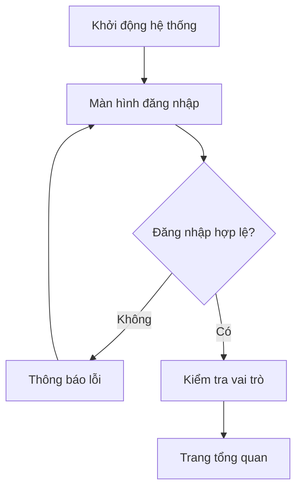
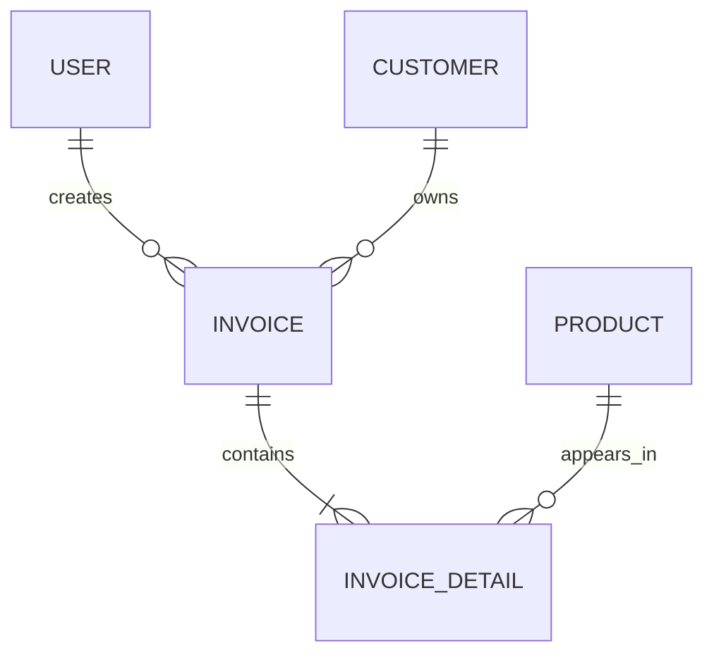

Bạn là chuyên gia phân tích, thiết kế hệ thống, thiết kế giao diện, cơ sở dữ liệu và phát triển phần mềm theo quy trình SDLC.

## 1. Tệp đầu vào

Hãy đọc kỹ, phân tích và đối chiếu toàn bộ nội dung của các tệp sau theo đúng thứ tự:

1. `01_GenAI_SoftwareDevelopment_project-plan.docx`
   Kế hoạch thực hiện dự án.

2. `02_GenAI_SoftwareDevelopment_requirements-qa.docx`
   Tài liệu thu thập và làm rõ yêu cầu.

3. `03_GenAI_SoftwareDevelopment_requirements-specification.docx`
   Đặc tả yêu cầu phần mềm.

4. `04_GenAI_SoftwareDevelopment_object-oriented-design.docx`
   Tài liệu phân tích và thiết kế hướng đối tượng.

5. `05_GenAI_SoftwareDevelopment_functional-testing.docx`
   Tài liệu kiểm thử chức năng.

## 2. Tệp đầu ra

Tạo tài liệu Word có tên:

`06_GenAI_SoftwareDevelopment_screenflow_db.docx`

Tiêu đề chính của tài liệu:

**SCREEN FLOW VÀ TÀI LIỆU THIẾT KẾ CƠ SỞ DỮ LIỆU**

## 3. Mục tiêu

Dựa hoàn toàn trên các tệp đầu vào, hãy xây dựng tài liệu mô tả:

* Luồng chuyển đổi giữa các màn hình của hệ thống;
* Danh sách và chức năng của từng màn hình;
* Quyền truy cập màn hình theo vai trò người dùng;
* Mối liên hệ giữa màn hình, yêu cầu chức năng, use case, lớp đối tượng và ca kiểm thử;
* Thiết kế cơ sở dữ liệu logic và vật lý;
* Các bảng dữ liệu, trường dữ liệu, khóa, ràng buộc và quan hệ;
* Cách lưu trữ dữ liệu liên quan đến chức năng AI, nếu hệ thống có tích hợp AI.

Tài liệu phải bảo đảm tính nhất quán và khả năng truy vết với các tài liệu từ giai đoạn 01 đến giai đoạn 05.

## 4. Nguyên tắc thực hiện

### 4.1. Đọc và đối chiếu tài liệu

Trước khi viết, phải xác định:

* Tên chính xác của dự án;
* Phạm vi dự án;
* Các actor và vai trò người dùng;
* Danh sách yêu cầu chức năng;
* Danh sách yêu cầu phi chức năng;
* Các use case;
* Các lớp đối tượng;
* Các sequence diagram;
* Các chức năng có tích hợp AI;
* Các ca kiểm thử chức năng;
* Các quy tắc nghiệp vụ;
* Các đối tượng dữ liệu cần lưu trữ.

Không được tự ý thay đổi tên dự án, actor, yêu cầu, use case, lớp, chức năng hoặc mã định danh đã được xác định trong các tài liệu đầu vào.

### 4.2. Bảo đảm truy vết

Mỗi màn hình và mỗi bảng dữ liệu phải liên kết được với một hoặc nhiều thành phần đã có, chẳng hạn:

* Requirement ID;
* Use Case ID;
* Class ID hoặc tên lớp;
* Sequence Diagram ID;
* Test Case ID;
* Business Rule ID.

Nếu thông tin chưa được xác định trong tài liệu đầu vào, phải ghi rõ:

**“Chưa được xác định trong tài liệu đầu vào – cần nhóm dự án xác nhận.”**

Không được tự tạo dữ liệu nghiệp vụ quan trọng mà không đánh dấu đó là giả định.

### 4.3. Xử lý mâu thuẫn

Nếu phát hiện nội dung giữa các tệp không thống nhất:

* Liệt kê nội dung mâu thuẫn;
* Chỉ rõ tệp và mục có liên quan;
* Đề xuất cách xử lý;
* Không tự động lựa chọn một phương án mà không ghi chú.

## 5. Cấu trúc tài liệu đầu ra

Tài liệu phải có tối thiểu các phần sau.

# TRANG BÌA

Trình bày:

* Tên trường;
* Tên khoa hoặc bộ môn;
* Tên học phần;
* Tên dự án;
* Tên tài liệu;
* Tên nhóm;
* Danh sách thành viên;
* Giảng viên hướng dẫn;
* Địa điểm và năm thực hiện.

Thông tin chưa có phải để dưới dạng placeholder, không được tự bịa đặt.

# LỊCH SỬ THAY ĐỔI TÀI LIỆU

Tạo bảng gồm:

| Phiên bản | Ngày cập nhật | Người cập nhật | Nội dung thay đổi |
| --------- | ------------- | -------------- | ----------------- |

# MỤC LỤC

Tạo mục lục tự động bằng chức năng Table of Contents của Microsoft Word.

# 1. GIỚI THIỆU

## 1.1. Mục đích tài liệu

Nêu mục đích của tài liệu Screen Flow và thiết kế cơ sở dữ liệu.

## 1.2. Phạm vi tài liệu

Nêu rõ các nội dung được thiết kế và các nội dung không thuộc phạm vi.

## 1.3. Tài liệu tham chiếu

Liệt kê đầy đủ năm tệp đầu vào.

## 1.4. Thuật ngữ và từ viết tắt

Giải thích các thuật ngữ như:

* UI;
* UX;
* Screen Flow;
* ERD;
* PK;
* FK;
* CRUD;
* RBAC;
* AI;
* LLM;
* API;
* RAG;
* các thuật ngữ riêng của dự án.

# 2. TỔNG QUAN HỆ THỐNG

## 2.1. Mô tả tổng quan

Tóm tắt mục tiêu và phạm vi của hệ thống dựa trên tài liệu đầu vào.

## 2.2. Actor và vai trò người dùng

Tạo bảng:

| Mã actor | Tên actor | Mô tả | Chức năng chính | Quyền truy cập |
| -------- | --------- | ----- | --------------- | -------------- |

## 2.3. Phân hệ chức năng

Tạo bảng:

| Mã phân hệ | Tên phân hệ | Mô tả | Actor sử dụng | Yêu cầu liên quan |
| ---------- | ----------- | ----- | ------------- | ----------------- |

## 2.4. Kiến trúc điều hướng tổng thể

Mô tả cách người dùng truy cập hệ thống, đăng nhập, lựa chọn chức năng và chuyển đổi giữa các phân hệ.

# 3. QUY ƯỚC THIẾT KẾ GIAO DIỆN

Trình bày các quy ước chung:

* Bố cục màn hình;
* Thanh tiêu đề;
* Thanh menu;
* Thanh điều hướng;
* Breadcrumb;
* Vùng tìm kiếm;
* Vùng lọc dữ liệu;
* Bảng dữ liệu;
* Phân trang;
* Nút thêm, sửa, xóa, lưu, hủy;
* Hộp thoại xác nhận;
* Thông báo thành công;
* Thông báo lỗi;
* Kiểm tra dữ liệu đầu vào;
* Trạng thái tải dữ liệu;
* Trạng thái không có dữ liệu;
* Giao diện đáp ứng;
* Khả năng truy cập;
* Quy tắc hiển thị dữ liệu nhạy cảm;
* Quy tắc hiển thị kết quả do AI sinh ra.

# 4. DANH MỤC MÀN HÌNH

Lập danh sách đầy đủ các màn hình của hệ thống.

Tạo bảng:

| Screen ID | Tên màn hình | Phân hệ | Actor | Mục đích | Requirement ID | Use Case ID | Test Case ID |
| --------- | ------------ | ------- | ----- | -------- | -------------- | ----------- | ------------ |

Quy tắc đặt mã màn hình:

* `SCR-AUTH-001`: màn hình đăng nhập;
* `SCR-DASH-001`: màn hình tổng quan;
* `SCR-[PHANHE]-[SOTHUTU]`: các màn hình nghiệp vụ.

Phải ưu tiên sử dụng mã đã có trong tài liệu đầu vào. Chỉ tạo mã mới khi chưa có mã tương ứng.

# 5. SCREEN FLOW TỔNG THỂ

## 5.1. Luồng truy cập hệ thống

Mô tả luồng:

* Mở ứng dụng;
* Xác thực;
* Phân quyền;
* Hiển thị menu;
* Truy cập chức năng;
* Đăng xuất;
* Hết phiên làm việc;
* Truy cập trái phép.

## 5.2. Sơ đồ Screen Flow tổng thể

Xây dựng sơ đồ bằng Mermaid.

Ví dụ cấu trúc:

Sơ đồ thực tế phải được xây dựng theo đúng actor và chức năng của dự án.

## 5.3. Screen Flow theo actor

Với mỗi actor, xây dựng một luồng màn hình riêng:

* Điểm bắt đầu;
* Danh sách màn hình có thể truy cập;
* Các thao tác điều hướng;
* Điều kiện chuyển màn hình;
* Nhánh thành công;
* Nhánh thất bại;
* Nhánh hủy thao tác;
* Nhánh không đủ quyền;
* Điểm kết thúc.

## 5.4. Screen Flow theo phân hệ

Với từng phân hệ, mô tả luồng:

* Danh sách;
* Tìm kiếm;
* Lọc;
* Xem chi tiết;
* Thêm mới;
* Chỉnh sửa;
* Xóa;
* Xác nhận;
* Xuất dữ liệu;
* Nhập dữ liệu;
* Sử dụng chức năng AI, nếu có.

# 6. ĐẶC TẢ CHI TIẾT MÀN HÌNH

Mỗi màn hình phải được đặc tả theo mẫu thống nhất sau.

## 6.x. [Screen ID] – [Tên màn hình]

### a. Thông tin chung

| Thuộc tính          | Nội dung |
| ------------------- | -------- |
| Screen ID           |          |
| Tên màn hình        |          |
| Phân hệ             |          |
| Actor sử dụng       |          |
| Mục đích            |          |
| Màn hình trước      |          |
| Màn hình tiếp theo  |          |
| Requirement ID      |          |
| Use Case ID         |          |
| Sequence Diagram ID |          |
| Test Case ID        |          |

### b. Điều kiện truy cập

Nêu rõ:

* Người dùng phải đăng nhập hay không;
* Vai trò được phép truy cập;
* Quyền cần có;
* Điều kiện dữ liệu;
* Điều kiện nghiệp vụ.

### c. Thành phần giao diện

Tạo bảng:

| Control ID | Tên thành phần | Loại điều khiển | Dữ liệu hiển thị | Bắt buộc | Có thể chỉnh sửa | Quy tắc |
| ---------- | -------------- | --------------- | ---------------- | -------- | ---------------- | ------- |

Bao gồm:

* Label;
* Textbox;
* Password;
* Combobox;
* Checkbox;
* Radio button;
* Date picker;
* Table;
* Button;
* Modal;
* Message;
* Chatbot;
* Khu vực hiển thị nội dung AI.

### d. Quy tắc kiểm tra dữ liệu

Tạo bảng:

| Validation ID | Trường dữ liệu | Điều kiện hợp lệ | Thông báo lỗi |
| ------------- | -------------- | ---------------- | ------------- |

### e. Hành động của người dùng

Tạo bảng:

| Action ID | Hành động | Điều kiện | Xử lý hệ thống | Kết quả |
| --------- | --------- | --------- | -------------- | ------- |

### f. Luồng màn hình

Mô tả:

* Luồng chính;
* Luồng thay thế;
* Luồng ngoại lệ;
* Luồng quay lại;
* Luồng hủy;
* Luồng hết phiên;
* Luồng không đủ quyền.

### g. Dữ liệu sử dụng

Tạo bảng:

| Thành phần giao diện | Bảng dữ liệu | Trường dữ liệu | Thao tác CRUD |
| -------------------- | ------------ | -------------- | ------------- |

### h. Thông báo

Tạo bảng:

| Message ID | Tình huống | Nội dung thông báo | Loại |
| ---------- | ---------- | ------------------ | ---- |

### i. Tiêu chí chấp nhận

Liệt kê tiêu chí chấp nhận có thể kiểm thử được và liên kết với Test Case ID.

### j. Wireframe

Tạo wireframe dạng bảng, sơ đồ ASCII hoặc Mermaid.

Nếu không thể tạo hình ảnh trực tiếp, phải trình bày bố cục đủ rõ để nhóm phát triển dựng lại giao diện.

# 7. MA TRẬN PHÂN QUYỀN MÀN HÌNH

Tạo bảng theo dạng:

| Screen ID |   Admin | Quản lý | Nhân viên | Khách hàng | Vai trò khác |
| --------- | ------: | ------: | --------: | ---------: | -----------: |
| SCR-...   | Xem/Sửa |     Xem |     Không |      Không |          ... |

Các vai trò phải lấy từ tài liệu đầu vào, không mặc định sử dụng các vai trò trong ví dụ.

# 8. MA TRẬN TRUY VẾT MÀN HÌNH

Tạo bảng:

| Screen ID | Requirement ID | Use Case ID | Class/Service | Sequence ID | Test Case ID | Bảng dữ liệu |
| --------- | -------------- | ----------- | ------------- | ----------- | ------------ | ------------ |

Mỗi yêu cầu chức năng có giao diện phải được ánh xạ đến ít nhất một màn hình.

# 9. TỔNG QUAN THIẾT KẾ CƠ SỞ DỮ LIỆU

## 9.1. Mục tiêu thiết kế

Trình bày mục tiêu:

* Bảo đảm toàn vẹn dữ liệu;
* Hỗ trợ nghiệp vụ;
* Hỗ trợ truy vấn;
* Hỗ trợ mở rộng;
* Bảo mật dữ liệu;
* Hỗ trợ kiểm thử;
* Hỗ trợ tích hợp AI.

## 9.2. Phạm vi dữ liệu

Xác định các nhóm dữ liệu:

* Người dùng và phân quyền;
* Danh mục;
* Nghiệp vụ chính;
* Giao dịch;
* Báo cáo;
* Nhật ký hệ thống;
* Dữ liệu AI;
* Dữ liệu cấu hình.

## 9.3. Hệ quản trị cơ sở dữ liệu

Sử dụng hệ quản trị cơ sở dữ liệu đã được lựa chọn trong tài liệu đầu vào.

Nếu tài liệu đầu vào chưa chỉ rõ, ghi:

**“Hệ quản trị cơ sở dữ liệu chưa được xác định trong tài liệu đầu vào.”**

Sau đó có thể đưa ra một đề xuất riêng và ghi rõ đó là đề xuất, không phải yêu cầu đã được phê duyệt.

## 9.4. Nguyên tắc đặt tên

Quy định:

* Tên bảng;
* Tên cột;
* Khóa chính;
* Khóa ngoại;
* Chỉ mục;
* Ràng buộc;
* View;
* Stored procedure, nếu có;
* Quy tắc viết hoa, viết thường;
* Quy tắc dùng số ít hoặc số nhiều.

# 10. MÔ HÌNH DỮ LIỆU KHÁI NIỆM

## 10.1. Danh sách thực thể

Tạo bảng:

| Entity ID | Tên thực thể | Mô tả | Nguồn xác định | Class liên quan |
| --------- | ------------ | ----- | -------------- | --------------- |

## 10.2. Quan hệ giữa các thực thể

Tạo bảng:

| Thực thể cha | Quan hệ | Thực thể con | Bội số | Mô tả |
| ------------ | ------- | ------------ | ------ | ----- |

## 10.3. Sơ đồ ERD khái niệm

Sử dụng Mermaid `erDiagram`.

Ví dụ:

Sơ đồ thực tế phải được xây dựng theo đúng nghiệp vụ của dự án.

# 11. MÔ HÌNH DỮ LIỆU LOGIC

## 11.1. Chuyển đổi từ lớp sang bảng

Tạo bảng:

| Lớp trong OOD | Bảng dữ liệu | Cách ánh xạ | Ghi chú |
| ------------- | ------------ | ----------- | ------- |

Phân biệt rõ:

* Lớp thực thể;
* Lớp dịch vụ;
* Lớp điều khiển;
* Lớp giao diện;
* Value object;
* Lớp AI;
* Lớp không cần lưu trong cơ sở dữ liệu.

## 11.2. Chuẩn hóa dữ liệu

Phân tích dữ liệu theo:

* Dạng chuẩn 1NF;
* Dạng chuẩn 2NF;
* Dạng chuẩn 3NF.

Nêu rõ trường hợp cố ý phi chuẩn hóa để tối ưu hiệu năng, nếu có.

## 11.3. Sơ đồ ERD logic

Thể hiện đầy đủ:

* Thực thể;
* Thuộc tính chính;
* Khóa chính;
* Khóa ngoại;
* Quan hệ;
* Bội số;
* Bảng liên kết nhiều – nhiều.

# 12. TỪ ĐIỂN DỮ LIỆU

Mỗi bảng phải được mô tả theo mẫu sau.

## 12.x. Bảng `[Tên bảng]`

### a. Thông tin chung

| Thuộc tính            | Nội dung |
| --------------------- | -------- |
| Tên bảng              |          |
| Mục đích              |          |
| Thực thể tương ứng    |          |
| Class tương ứng       |          |
| Requirement liên quan |          |
| Màn hình liên quan    |          |

### b. Danh sách trường

| STT | Tên trường | Kiểu dữ liệu | Độ dài | Cho phép NULL | Giá trị mặc định | PK | FK | Unique | Mô tả |
| --: | ---------- | ------------ | -----: | ------------- | ---------------- | -- | -- | ------ | ----- |

### c. Ràng buộc

Tạo bảng:

| Constraint ID | Loại | Trường | Biểu thức hoặc quy tắc | Mô tả |
| ------------- | ---- | ------ | ---------------------- | ----- |

Bao gồm:

* Primary Key;
* Foreign Key;
* Unique;
* Not Null;
* Check;
* Default;
* Cascade;
* Restrict.

### d. Chỉ mục

Tạo bảng:

| Index ID | Trường | Loại chỉ mục | Mục đích |
| -------- | ------ | ------------ | -------- |

### e. Quy tắc nghiệp vụ

Liệt kê các quy tắc ảnh hưởng đến việc thêm, sửa, xóa và truy vấn dữ liệu.

# 13. THIẾT KẾ DỮ LIỆU PHÂN QUYỀN

Thiết kế các cấu trúc dữ liệu cần thiết cho:

* User;
* Role;
* Permission;
* UserRole;
* RolePermission;
* Session;
* RefreshToken hoặc thông tin phiên, nếu có;
* Nhật ký đăng nhập;
* Trạng thái tài khoản.

Mô hình phải phù hợp với tài liệu OOD và yêu cầu phân quyền đã có.

# 14. THIẾT KẾ DỮ LIỆU CHỨC NĂNG AI

Nếu hệ thống có tích hợp AI, cần xác định cách lưu trữ tối thiểu các thông tin phù hợp với yêu cầu dự án:

* Prompt template;
* Phiên bản prompt;
* AI request;
* AI response;
* Model name;
* Model version;
* Input context;
* Output content;
* Timestamp;
* Người gửi yêu cầu;
* Trạng thái xử lý;
* Số token đầu vào;
* Số token đầu ra;
* Chi phí ước tính;
* Thời gian phản hồi;
* Mã lỗi;
* Nội dung đã kiểm duyệt;
* Đánh giá của người dùng;
* Nhật ký truy vết;
* Dữ liệu đã ẩn thông tin nhạy cảm;
* Kết quả kiểm tra đầu ra AI.

Không lưu API key ở dạng văn bản thuần trong cơ sở dữ liệu.

Nếu dự án không có yêu cầu lưu trữ một loại dữ liệu AI cụ thể, phải ghi rõ nội dung đó là đề xuất mở rộng.

# 15. THIẾT KẾ DỮ LIỆU NHẬT KÝ VÀ KIỂM TOÁN

Mô tả cách lưu:

* Người thực hiện;
* Hành động;
* Đối tượng bị tác động;
* Giá trị trước khi thay đổi;
* Giá trị sau khi thay đổi;
* Thời gian;
* Địa chỉ IP, nếu cần;
* Request ID;
* Trạng thái;
* Thông tin lỗi.

# 16. QUY TẮC TOÀN VẸN DỮ LIỆU

Phân tích:

* Toàn vẹn thực thể;
* Toàn vẹn tham chiếu;
* Toàn vẹn miền giá trị;
* Toàn vẹn nghiệp vụ;
* Xử lý xóa mềm;
* Xử lý dữ liệu lịch sử;
* Xử lý giao dịch;
* Xử lý đồng thời;
* Xử lý rollback.

# 17. BẢO MẬT CƠ SỞ DỮ LIỆU

Trình bày:

* Mã hóa mật khẩu;
* Mã hóa dữ liệu nhạy cảm;
* Che giấu dữ liệu;
* Phân quyền truy cập;
* Nguyên tắc đặc quyền tối thiểu;
* Chống SQL Injection;
* Backup và restore;
* Nhật ký truy cập;
* Quản lý bí mật;
* Không lưu API key trực tiếp;
* Bảo vệ dữ liệu gửi đến mô hình AI.

# 18. HIỆU NĂNG VÀ KHẢ NĂNG MỞ RỘNG

Phân tích:

* Chỉ mục;
* Phân trang;
* Truy vấn thường xuyên;
* Truy vấn báo cáo;
* Tránh truy vấn N+1;
* Cache;
* Lưu trữ dữ liệu lớn;
* Lưu trữ lịch sử;
* Phân vùng dữ liệu, nếu cần;
* Dữ liệu vector, nếu hệ thống sử dụng RAG;
* Khả năng mở rộng số lượng người dùng và giao dịch.

# 19. SCRIPT KHỞI TẠO CƠ SỞ DỮ LIỆU

Sinh mã SQL phù hợp với hệ quản trị cơ sở dữ liệu được xác định trong tài liệu đầu vào.

Script cần bao gồm:

* Tạo database hoặc schema;
* Tạo bảng;
* Tạo khóa chính;
* Tạo khóa ngoại;
* Tạo unique constraint;
* Tạo check constraint;
* Tạo default constraint;
* Tạo chỉ mục;
* Tạo dữ liệu danh mục ban đầu cần thiết;
* Tạo role hoặc quyền truy cập cơ bản, nếu thuộc phạm vi.

Mã SQL phải nhất quán với từ điển dữ liệu và ERD.

# 20. DỮ LIỆU MẪU

Tạo một số dữ liệu mẫu để hỗ trợ kiểm thử.

Yêu cầu:

* Không sử dụng dữ liệu cá nhân thật;
* Không sử dụng API key thật;
* Không sử dụng mật khẩu dạng rõ;
* Dữ liệu mẫu phải phù hợp với các ca kiểm thử chức năng;
* Mỗi bảng chính nên có dữ liệu đủ để kiểm tra thêm, sửa, xóa, tìm kiếm và lọc.

# 21. ÁNH XẠ MÀN HÌNH – API – CƠ SỞ DỮ LIỆU

Tạo bảng:

| Screen ID | Thao tác | API dự kiến | HTTP Method | Bảng dữ liệu | CRUD | Requirement ID | Test Case ID |
| --------- | -------- | ----------- | ----------- | ------------ | ---- | -------------- | ------------ |

Không tự tạo API trái với kiến trúc trong tài liệu OOD.

# 22. MA TRẬN CRUD

Tạo ma trận:

| Chức năng hoặc màn hình | Bảng 1  | Bảng 2 | Bảng 3 | ... |
| ----------------------- | ------- | ------ | ------ | --- |
| Chức năng A             | C/R/U/D | R      | -      | ... |

Ký hiệu:

* C: Create;
* R: Read;
* U: Update;
* D: Delete.

# 23. MA TRẬN TRUY VẾT DỮ LIỆU

Tạo bảng:

| Requirement ID | Use Case ID | Class | Screen ID | API | Bảng dữ liệu | Test Case ID |
| -------------- | ----------- | ----- | --------- | --- | ------------ | ------------ |

Kiểm tra để bảo đảm:

* Mỗi yêu cầu chức năng có dữ liệu tương ứng;
* Mỗi lớp thực thể được ánh xạ hợp lý;
* Mỗi màn hình nghiệp vụ có nguồn dữ liệu;
* Mỗi ca kiểm thử có dữ liệu đầu vào phù hợp.

# 24. ĐỐI CHIẾU VỚI TÀI LIỆU KIỂM THỬ

Phân tích các ca kiểm thử trong tệp:

`05_GenAI_SoftwareDevelopment_functional-testing.docx`

Xác định:

* Màn hình được kiểm thử;
* Dữ liệu tiền điều kiện;
* Dữ liệu đầu vào;
* Bảng bị tác động;
* Giá trị mong đợi;
* Dữ liệu cần làm sạch sau kiểm thử;
* Test Case ID tương ứng.

Tạo bảng:

| Test Case ID | Screen ID | Dữ liệu đầu vào | Bảng bị tác động | Kết quả dữ liệu mong đợi |
| ------------ | --------- | --------------- | ---------------- | ------------------------ |

# 25. CÁC GIẢ ĐỊNH VÀ VẤN ĐỀ CẦN XÁC NHẬN

Tạo bảng:

| ID | Nội dung | Loại | Mức độ ảnh hưởng | Tài liệu liên quan | Đề xuất xử lý |
| -- | -------- | ---- | ---------------- | ------------------ | ------------- |

Phân loại:

* Thiếu thông tin;
* Mâu thuẫn;
* Giả định;
* Rủi ro;
* Cần xác nhận.

# 26. KẾT LUẬN

Tóm tắt:

* Phạm vi Screen Flow đã xây dựng;
* Số lượng màn hình;
* Số lượng bảng dữ liệu;
* Các quan hệ chính;
* Mức độ đáp ứng yêu cầu;
* Các vấn đề còn cần xác nhận;
* Khả năng sử dụng tài liệu cho giai đoạn lập trình và kiểm thử.

# PHỤ LỤC

Bao gồm:

* Danh sách Screen ID;
* Danh sách Table ID;
* Danh sách Constraint ID;
* Danh sách Index ID;
* Danh sách Message ID;
* Danh sách Validation ID;
* Toàn bộ mã Mermaid;
* Toàn bộ mã SQL;
* Bảng truy vết tổng hợp.

## 6. Yêu cầu chất lượng nội dung

Tài liệu đầu ra phải:

1. Bám sát tuyệt đối nội dung các tệp đầu vào.
2. Không thêm chức năng ngoài phạm vi khi chưa ghi rõ là đề xuất.
3. Không bỏ sót actor, yêu cầu chức năng, use case, lớp thực thể hoặc ca kiểm thử quan trọng.
4. Nhất quán về tên gọi và mã định danh.
5. Phân biệt rõ lớp nghiệp vụ và bảng dữ liệu.
6. Bảo đảm mỗi màn hình có dữ liệu đầu vào, đầu ra và điều hướng rõ ràng.
7. Bảo đảm mỗi bảng có khóa chính.
8. Bảo đảm khóa ngoại và bội số quan hệ hợp lý.
9. Bảo đảm mô hình dữ liệu đáp ứng ít nhất chuẩn 3NF, trừ trường hợp có lý do phi chuẩn hóa.
10. Bảo đảm dữ liệu AI, dữ liệu nhạy cảm và thông tin xác thực được thiết kế an toàn.
11. Bảo đảm truy vết hai chiều giữa yêu cầu, màn hình, lớp, bảng dữ liệu và ca kiểm thử.
12. Không viết nội dung chung chung hoặc mang tính giáo trình.
13. Sử dụng thuật ngữ chuyên ngành chính xác.
14. Mọi bảng, sơ đồ và script phải thống nhất với nhau.

## 7. Yêu cầu định dạng tệp Word

Tệp `06_GenAI_SoftwareDevelopment_screenflow_db.docx` phải được định dạng như sau:

* Khổ giấy: A4;
* Hướng giấy: dọc; các bảng quá rộng có thể dùng trang ngang;
* Lề trên: 2 cm;
* Lề dưới: 2 cm;
* Lề trái: 3 cm;
* Lề phải: 2 cm;
* Phông chữ: Times New Roman;
* Cỡ chữ nội dung: 13 pt;
* Tiêu đề cấp 1: 16 pt, in đậm;
* Tiêu đề cấp 2: 14 pt, in đậm;
* Tiêu đề cấp 3: 13 pt, in đậm;
* Giãn dòng: 1,15;
* Khoảng cách sau đoạn: 6 pt;
* Căn đều hai lề;
* Đánh số đề mục tự động;
* Đánh số trang;
* Có header và footer phù hợp;
* Có mục lục tự động;
* Các bảng sử dụng AutoFit Window hoặc độ rộng 100% trang;
* Hàng tiêu đề bảng in đậm và lặp lại khi bảng sang trang;
* Không để bảng bị tràn lề;
* Tên bảng đặt phía trên bảng;
* Tên hình và sơ đồ đặt phía dưới;
* Mã SQL và Mermaid sử dụng phông chữ đơn cách;
* Không để tiêu đề nằm cuối trang mà không có nội dung theo sau.

## 8. Kiểm tra trước khi hoàn thành

Trước khi lưu tệp, hãy tự kiểm tra:

* Tên dự án có thống nhất trong toàn bộ tài liệu không?
* Tất cả actor có màn hình tương ứng không?
* Tất cả yêu cầu giao diện có Screen ID không?
* Tất cả màn hình có luồng vào và luồng ra không?
* Tất cả lớp thực thể có được xem xét ánh xạ sang bảng không?
* Tất cả bảng có khóa chính không?
* Tất cả khóa ngoại có bảng và trường tham chiếu hợp lệ không?
* ERD có thống nhất với từ điển dữ liệu không?
* SQL có thống nhất với ERD không?
* Màn hình có thống nhất với quyền người dùng không?
* Các chức năng AI có dữ liệu và cơ chế truy vết phù hợp không?
* Các ca kiểm thử có dữ liệu kiểm thử tương ứng không?
* Có nội dung nào tự suy diễn nhưng chưa được đánh dấu là giả định không?
* Các bảng có vừa chiều rộng trang không?
* Mục lục có thể cập nhật tự động không?

## 9. Kết quả cuối cùng

Sau khi hoàn thành:

1. Lưu tài liệu đúng tên:

   `06_GenAI_SoftwareDevelopment_screenflow_db.docx`

2. Không tạo thêm tệp đầu ra khác nếu không cần thiết.

3. Cuối quá trình, báo cáo ngắn gọn:

* Tệp đã tạo;
* Số màn hình đã đặc tả;
* Số Screen Flow đã xây dựng;
* Số bảng dữ liệu đã thiết kế;
* Số quan hệ trong ERD;
* Số script SQL đã tạo;
* Các nội dung còn thiếu hoặc cần nhóm dự án xác nhận.
